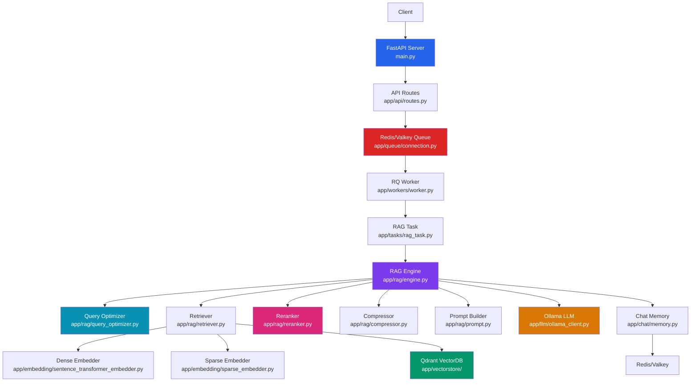
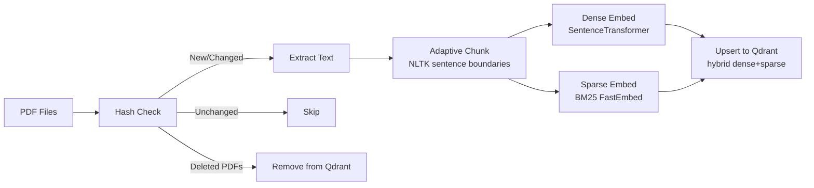
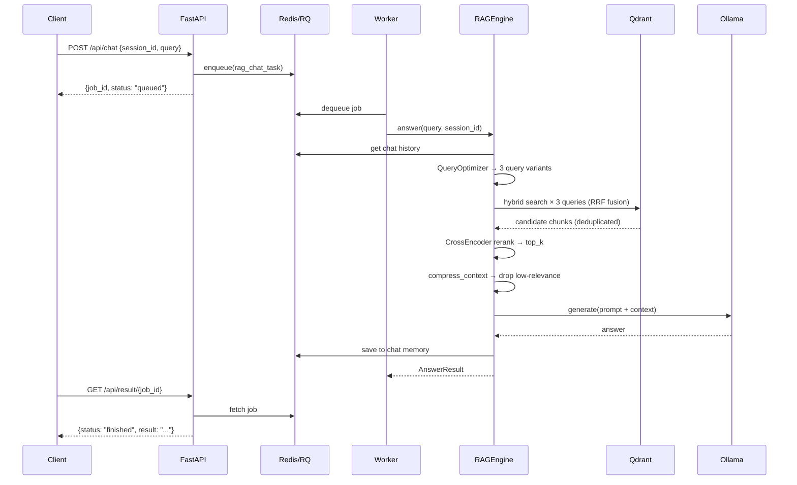

# RAG Chat Application — Complete Project Walkthrough

## Overview

This is a **production-grade Retrieval-Augmented Generation (RAG)** chat application that lets users ask questions about PDF documents. The system ingests PDFs, chunks and embeds them into a vector database, and uses an LLM to answer questions grounded in the document content — with conversational memory, multi-query expansion, cross-encoder reranking, and context compression.

---

## Architecture



The system has **two operational modes**:
1. **API mode** — Async via FastAPI + Redis Queue (production)
2. **CLI mode** — Synchronous interactive chat via [cli.py](file:///c:/Users/devsr/OneDrive/Desktop/major%20project/rag-app/cli.py) (development/testing)

---

## Tech Stack

| Component | Technology | Purpose |
|---|---|---|
| Web Framework | **FastAPI** | HTTP API server |
| Job Queue | **Redis (Valkey) + RQ** | Async job processing |
| Vector Database | **Qdrant** | Hybrid dense+sparse similarity search |
| Dense Embeddings | **SentenceTransformers** (`all-MiniLM-L6-v2`) | Text → 384-dim vectors |
| Sparse Embeddings | **FastEmbed** (BM25 via `Qdrant/bm25`) | Keyword-exact token matching |
| Reranker | **CrossEncoder** (`ms-marco-MiniLM-L-6-v2`) | Precision boosting post-retrieval |
| LLM | **Ollama** (`llama3.2:latest`) | Answer generation |
| PDF Parsing | **pypdf** | PDF text extraction |
| Text Chunking | **NLTK** (`sent_tokenize`) | Sentence-boundary aware chunking |
| Chat Memory | **Redis** | Session-based conversation history |

---

## RAG Pipeline Flow

```
User Query
    ↓
[Query Optimizer]  ← uses LLM to generate 3 query variants (multi-query expansion + anaphora resolution)
    ↓
[Hybrid Retriever × 3 queries]  ← Dense (cosine) + Sparse (BM25) → merged via RRF fusion in Qdrant
    ↓ (deduplicated pool of up to top_k×2 chunks)
[CrossEncoder Reranker]  ← re-scores all candidates with ms-marco model for high precision
    ↓ (top_k best chunks)
[Context Compressor]  ← drops chunks failing score threshold or keyword overlap check
    ↓
[Prompt Builder]  ← assembles system prompt + chat history + compressed context
    ↓
[Ollama LLM]  ← generates answer grounded in context only
    ↓
AnswerResult { answer, citations, retrieval_metrics, latency_metrics }
```

---

## File-by-File Breakdown

### Root Files

| File | Purpose |
|---|---|
| [main.py](file:///c:/Users/devsr/OneDrive/Desktop/major%20project/rag-app/main.py) | FastAPI app entrypoint. Creates the app, mounts the API router at `/api`. No business logic. |
| [cli.py](file:///c:/Users/devsr/OneDrive/Desktop/major%20project/rag-app/cli.py) | CLI chat interface. Checks all services, runs ingestion, then starts an interactive Q&A loop with live latency metrics and citations. |
| [requirements.txt](file:///c:/Users/devsr/OneDrive/Desktop/major%20project/rag-app/requirements.txt) | Pinned Python dependencies. Key: fastapi, rq, redis, qdrant-client, sentence-transformers, fastembed, nltk, pypdf, torch. |

---

### `app/api/` — HTTP API Layer

| File | What It Does |
|---|---|
| [routes.py](file:///c:/Users/devsr/OneDrive/Desktop/major%20project/rag-app/app/api/routes.py) | **3 endpoints**: `GET /api/health`, `POST /api/chat` (enqueues a RAG job, returns `job_id`), and `GET /api/result/{job_id}` (polls job status: queued / in_progress / finished / failed). |
| [schemas.py](file:///c:/Users/devsr/OneDrive/Desktop/major%20project/rag-app/app/api/schemas.py) | Pydantic models: `QueryRequest` (session_id + query), `QueryResponse` (job_id + status), `JobStatusResponse` (job_id + status + result/error). |

> [!IMPORTANT]
> The API is **asynchronous** — the client submits a query, gets a `job_id`, then polls for the result. The actual RAG work happens in a background RQ worker process.

---

### `app/chat/` — Conversation Memory

| File | What It Does |
|---|---|
| [memory.py](file:///c:/Users/devsr/OneDrive/Desktop/major%20project/rag-app/app/chat/memory.py) | `ChatMemory` class — stores chat history in Redis as a list of JSON messages (`{role, content}`). Keeps last 10 messages per session via `ltrim`. Supports `add_message()`, `get_history()`, `clear()`. |

---

### `app/embedding/` — Text Embedding

| File | What It Does |
|---|---|
| [base.py](file:///c:/Users/devsr/OneDrive/Desktop/major%20project/rag-app/app/embedding/base.py) | Abstract `BaseEmbedder` interface: `embed_text()`, `embed_batch()`, `dimension` property. |
| [sentence_transformer_embedder.py](file:///c:/Users/devsr/OneDrive/Desktop/major%20project/rag-app/app/embedding/sentence_transformer_embedder.py) | Concrete dense embedder using `all-MiniLM-L6-v2` (384 dimensions). L2-normalizes embeddings for cosine similarity. |
| [sparse_embedder.py](file:///c:/Users/devsr/OneDrive/Desktop/major%20project/rag-app/app/embedding/sparse_embedder.py) | BM25 sparse embedder using `fastembed` (`Qdrant/bm25`). Returns `(indices, values)` tuples for Qdrant's `SparseVector` format. |

---

### `app/ingestion/` — PDF Ingestion Pipeline

| File | What It Does |
|---|---|
| [pdf_loader.py](file:///c:/Users/devsr/OneDrive/Desktop/major%20project/rag-app/app/ingestion/pdf_loader.py) | Extracts text from PDF files using `pypdf`. Basic whitespace cleaning. |
| [chunker.py](file:///c:/Users/devsr/OneDrive/Desktop/major%20project/rag-app/app/ingestion/chunker.py) | **Adaptive chunker**: splits text respecting sentence boundaries (NLTK), paragraph boundaries (double newlines), and preserves fenced code blocks intact. Uses sentence-level overlap (`overlap_sentences=2` default). Target chunk size: 500 chars. |
| [hasher.py](file:///c:/Users/devsr/OneDrive/Desktop/major%20project/rag-app/app/ingestion/hasher.py) | Computes SHA-256 hash of file contents for change detection (avoids re-ingesting unchanged PDFs). |
| [pipeline.py](file:///c:/Users/devsr/OneDrive/Desktop/major%20project/rag-app/app/ingestion/pipeline.py) | `IngestionPipeline` — orchestrates: hash check → load text → chunk → embed (dense+sparse) → upsert to Qdrant. Also **reconciles** by removing vectors for deleted PDFs. |



---

### `app/llm/` — LLM Integration

| File | What It Does |
|---|---|
| [base.py](file:///c:/Users/devsr/OneDrive/Desktop/major%20project/rag-app/app/llm/base.py) | Abstract `BaseLLM` interface: `generate(prompt)` and `stream_generate(prompt)`. |
| [ollama_client.py](file:///c:/Users/devsr/OneDrive/Desktop/major%20project/rag-app/app/llm/ollama_client.py) | `OllamaClient` — communicates with local Ollama at `localhost:11434` using the `/api/chat` endpoint. Supports both blocking (`generate`) and streaming (`stream_generate`) generation. Default model: `llama3.2:latest` (configurable via `OLLAMA_MODEL` env var). |

---

### `app/queue/` — Job Queue

| File | What It Does |
|---|---|
| [connection.py](file:///c:/Users/devsr/OneDrive/Desktop/major%20project/rag-app/app/queue/connection.py) | Creates Redis connection (`localhost:6379`) and RQ queue named `"rag"`. |

> [!NOTE]
> On Windows, the `SimpleWorker` class must be used: `python -m app.workers.worker` (the worker auto-detects Windows).

---

### `app/rag/` — RAG Engine (Core)

| File | What It Does |
|---|---|
| [engine.py](file:///c:/Users/devsr/OneDrive/Desktop/major%20project/rag-app/app/rag/engine.py) | `RAGEngine` — orchestrates the full pipeline: query optimize → multi-query retrieve → rerank → compress → build prompt → LLM generate → save memory. Returns `AnswerResult` with answer, citations, eval metrics, and latency metrics. Both `answer()` (blocking) and `stream_answer()` (streaming, uses full pipeline too) are supported. |
| [retriever.py](file:///c:/Users/devsr/OneDrive/Desktop/major%20project/rag-app/app/rag/retriever.py) | `Retriever` — embeds the query with both dense and sparse embedders, performs hybrid RRF search in Qdrant, returns payload dicts. |
| [query_optimizer.py](file:///c:/Users/devsr/OneDrive/Desktop/major%20project/rag-app/app/rag/query_optimizer.py) | `QueryOptimizer` — uses the LLM to generate up to 3 diverse query variants per user question. With history, resolves anaphora (e.g. "what about it?" → "what about Node.js?"). Falls back to original query on LLM parse failure. |
| [reranker.py](file:///c:/Users/devsr/OneDrive/Desktop/major%20project/rag-app/app/rag/reranker.py) | `CrossEncoderReranker` — uses `cross-encoder/ms-marco-MiniLM-L-6-v2` to re-score all retrieved candidates against the query. Returns top N by cross-encoder score. |
| [compressor.py](file:///c:/Users/devsr/OneDrive/Desktop/major%20project/rag-app/app/rag/compressor.py) | `compress_context()` — two-pass filter: drops chunks below `score_threshold` OR with zero keyword overlap with the query. Guarantees at least 1 chunk survives (safety fallback). |
| [evaluator.py](file:///c:/Users/devsr/OneDrive/Desktop/major%20project/rag-app/app/rag/evaluator.py) | `evaluate_retrieval()` — computes `RetrievalMetrics`: top score, average score, coverage (% above threshold), result count, and source document names. |
| [citations.py](file:///c:/Users/devsr/OneDrive/Desktop/major%20project/rag-app/app/rag/citations.py) | `build_citations()` — maps retrieved chunks to `Citation` objects (source PDF, chunk index, relevance, 150-char snippet). `format_citations_cli()` renders them for CLI display. |
| [prompt.py](file:///c:/Users/devsr/OneDrive/Desktop/major%20project/rag-app/app/rag/prompt.py) | `build_prompt()` — constructs the LLM prompt with system instructions, chat history, document context, and user question. Instructs LLM to answer only from provided context. |

---

### `app/tasks/` — Worker Tasks

| File | What It Does |
|---|---|
| [rag_task.py](file:///c:/Users/devsr/OneDrive/Desktop/major%20project/rag-app/app/tasks/rag_task.py) | `rag_chat_task()` — the function executed by RQ workers. **Lazy-initializes** all components (embedder, sparse embedder, vectorstore, retriever, reranker, LLM, engine) as module-level singletons to avoid reloading the ~90MB model on every job. |

---

### `app/utils/` — Observability Utilities

| File | What It Does |
|---|---|
| [latency.py](file:///c:/Users/devsr/OneDrive/Desktop/major%20project/rag-app/app/utils/latency.py) | `LatencyTracker` — context manager that measures wall-clock time of any pipeline stage. `QueryMetrics` dataclass collects per-stage ms timing: `query_rewrite_ms`, `retrieval_ms`, `rerank_ms`, `compress_ms`, `llm_ms`, `total_ms`. |
| [trace.py](file:///c:/Users/devsr/OneDrive/Desktop/major%20project/rag-app/app/utils/trace.py) | `TraceLogger` — writes a step-by-step "thinking process" log entry to `logs/thinking_process.log` for every query. Captures query variants, retrieved chunks, rerank scores, compression decisions, and the final answer. |

---

### `app/vectorstore/` — Vector Database

| File | What It Does |
|---|---|
| [qdrant_client.py](file:///c:/Users/devsr/OneDrive/Desktop/major%20project/rag-app/app/vectorstore/qdrant_client.py) | `QdrantVectorStore` — wraps the Qdrant client. Supports hybrid collections (dense + sparse vectors). Key methods: `create_collection()`, `upsert_vectors()`, `search()` (RRF hybrid fusion), `get_all_doc_ids()`, `delete_by_doc_id()`, `collection_exists()`. |

---

### `app/workers/` — Background Workers

| File | What It Does |
|---|---|
| [worker.py](file:///c:/Users/devsr/OneDrive/Desktop/major%20project/rag-app/app/workers/worker.py) | Worker bootstrap script. Auto-selects `SimpleWorker` on Windows (fork() unavailable) or standard `Worker` on Linux/Mac. Listens on the `"rag"` queue. |

---

### `tests/` — Test Suite

| File | Tests |
|---|---|
| [tests/test_imports.py](file:///c:/Users/devsr/OneDrive/Desktop/major%20project/rag-app/tests/test_imports.py) | Verifies all module imports succeed without errors (catches circular imports, broken references). Also tests `build_prompt()`. |
| [tests/test_config.py](file:///c:/Users/devsr/OneDrive/Desktop/major%20project/rag-app/tests/test_config.py) | Tests `setup_logging()` creates correct file + console handlers with correct levels and rotation config. |
| [tests/test_latency.py](file:///c:/Users/devsr/OneDrive/Desktop/major%20project/rag-app/tests/test_latency.py) | Tests `LatencyTracker` measures duration correctly and `QueryMetrics` initializes with ISO timestamp. |
| [tests/test_eval_citations.py](file:///c:/Users/devsr/OneDrive/Desktop/major%20project/rag-app/tests/test_eval_citations.py) | Tests `evaluate_retrieval()` score math and `build_citations()` / `format_citations_cli()` output format. |
| [tests/test_chunker.py](file:///c:/Users/devsr/OneDrive/Desktop/major%20project/rag-app/tests/test_chunker.py) | Full test suite for the adaptive chunker: sentence boundaries, code block preservation, overlap behavior, edge cases. |
| [tests/test_compressor.py](file:///c:/Users/devsr/OneDrive/Desktop/major%20project/rag-app/tests/test_compressor.py) | Tests context compressor: score threshold filtering, keyword overlap filtering, safety fallback, order preservation. |
| [tests/test_query_optimizer.py](file:///c:/Users/devsr/OneDrive/Desktop/major%20project/rag-app/tests/test_query_optimizer.py) | Tests `QueryOptimizer` using a `MockLLM`: multi-query generation, history integration, markdown stripping, JSON fallback, 3-query limit. |
| [tests/test_sparse_embedder.py](file:///c:/Users/devsr/OneDrive/Desktop/major%20project/rag-app/tests/test_sparse_embedder.py) | Tests `SparseEmbedder` produces valid `(indices, values)` tuples as native Python lists. |
| [tests/test_reranker.py](file:///c:/Users/devsr/OneDrive/Desktop/major%20project/rag-app/tests/test_reranker.py) | Integration tests for `CrossEncoderReranker`: ordering, truncation, empty input. Loads the real model. |
| [tests/ingestion/test_chunker.py](file:///c:/Users/devsr/OneDrive/Desktop/major%20project/rag-app/tests/ingestion/test_chunker.py) | Ingestion-level chunker tests using the current adaptive API. |
| [tests/ingestion/test_hasher.py](file:///c:/Users/devsr/OneDrive/Desktop/major%20project/rag-app/tests/ingestion/test_hasher.py) | Tests SHA-256 hash consistency and change detection. |
| [tests/ingestion/test_pdf_loader.py](file:///c:/Users/devsr/OneDrive/Desktop/major%20project/rag-app/tests/ingestion/test_pdf_loader.py) | Tests PDF text extraction using a generated test PDF. |

---

### `data/` — Document Storage

Place PDF files to be ingested in:
```
data/pdfs/
```

---

## Request Flow (End-to-End)



---

## Key Design Decisions

1. **Strict layer isolation** — Each module has a "Must NOT" section enforcing separation of concerns
2. **Multi-query expansion** — 3 LLM-generated query variants maximize retrieval coverage
3. **Hybrid search** — Dense (semantic) + Sparse (BM25 keyword) merged via Reciprocal Rank Fusion
4. **CrossEncoder reranking** — Re-scores candidates using a dedicated cross-encoder model for precision
5. **Context compression** — Filters irrelevant chunks before LLM to reduce token waste
6. **Async job processing** — API never blocks on LLM calls; uses Redis Queue for background processing
7. **Hash-based deduplication** — PDFs identified by SHA-256; unchanged files skipped during re-ingestion
8. **Document reconciliation** — Deleted PDFs have their vectors automatically removed from Qdrant
9. **Adaptive sentence-aware chunking** — NLTK sentence tokenizer respects semantic boundaries
10. **Module-level singletons** — Worker reuses loaded models across jobs to avoid paying cold-start on every request
11. **Abstract interfaces** — `BaseEmbedder` and `BaseLLM` allow swapping implementations without any other changes
