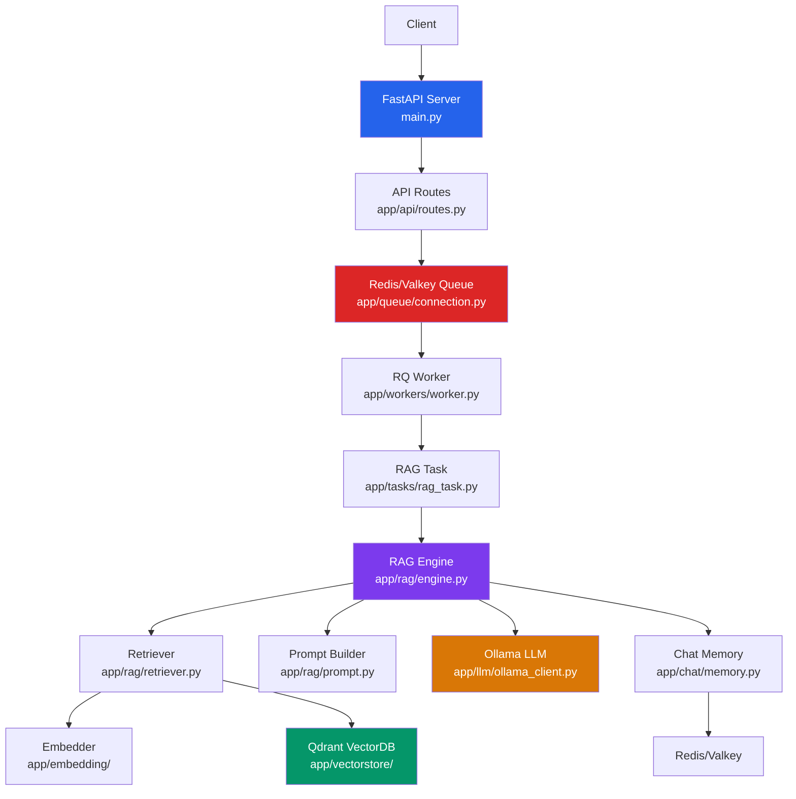
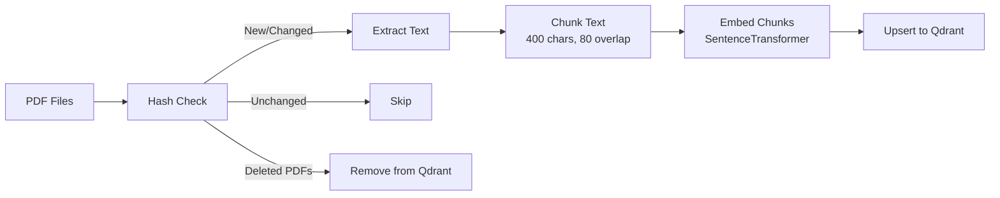
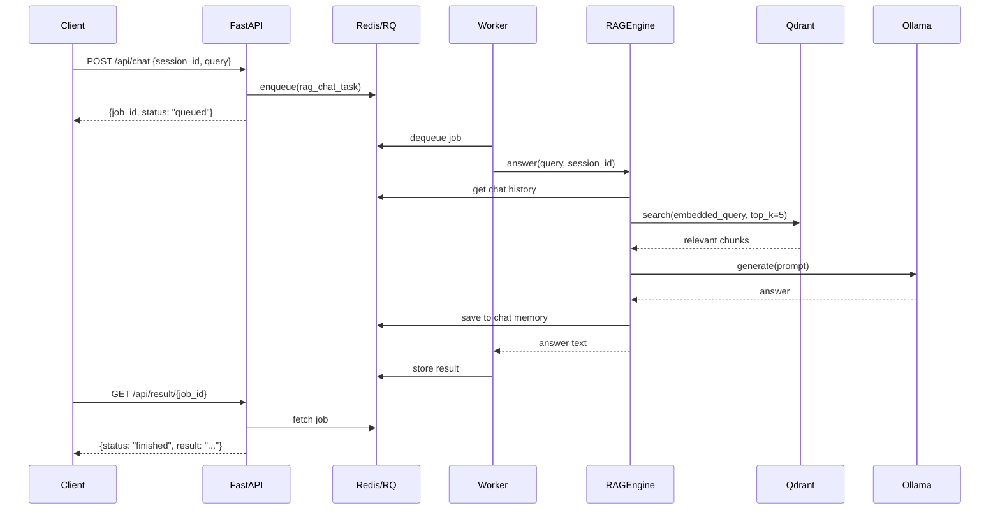

# RAG Chat Application — Complete Project Walkthrough

## Overview

This is a **Retrieval-Augmented Generation (RAG)** chat application that lets users ask questions about PDF documents. The system ingests PDFs, chunks and embeds them into a vector database, and uses an LLM to answer questions grounded in the document content — with conversational memory.

---

## Architecture

The system has **two operational modes**:
1. **API mode** — Async via FastAPI + Redis Queue (production)
2. **CLI mode** — Synchronous interactive chat via [cli.py](file:///c:/Users/devsr/OneDrive/Desktop/major%20project/rag-app/cli.py) (development)

---

## Tech Stack

| Component | Technology | Purpose |
|---|---|---|
| Web Framework | **FastAPI** | HTTP API server |
| Job Queue | **Redis (Valkey) + RQ** | Async job processing |
| Vector Database | **Qdrant** | Document similarity search |
| Embeddings | **SentenceTransformers** (`all-MiniLM-L6-v2`) | Text → 384-dim vectors |
| LLM | **Ollama** (`qwen2.5:7b-instruct`) | Answer generation |
| PDF Parsing | **pypdf** | PDF text extraction |
| Chat Memory | **Redis** | Session-based conversation history |

---

## File-by-File Breakdown

### Root Files

| File | Purpose |
|---|---|
| [main.py](file:///c:/Users/devsr/OneDrive/Desktop/major%20project/rag-app/main.py) | FastAPI app entrypoint. Creates the app, mounts the API router at `/api`. No business logic. |
| [cli.py](file:///c:/Users/devsr/OneDrive/Desktop/major%20project/rag-app/cli.py) | CLI chat interface. Runs ingestion then starts an interactive Q&A loop. Useful for local dev/testing. |
| [annotate_architecture.py](file:///c:/Users/devsr/OneDrive/Desktop/major%20project/rag-app/annotate_architecture.py) | Utility script that injects module-level docstrings into empty source files describing each module's responsibility. |
| [requirements.txt](file:///c:/Users/devsr/OneDrive/Desktop/major%20project/rag-app/requirements.txt) | Python dependencies: fastapi, uvicorn, pydantic, rq, redis, qdrant-client, requests, pytest, sentence-transformers, pypdf, reportlab |

---

### `app/api/` — HTTP API Layer

| File | What It Does |
|---|---|
| [routes.py](file:///c:/Users/devsr/OneDrive/Desktop/major%20project/rag-app/app/api/routes.py) | **2 endpoints**: `POST /api/chat` (enqueues a RAG job, returns `job_id`) and `GET /api/result/{job_id}` (polls job status: queued / in_progress / finished / failed). |
| [schemas.py](file:///c:/Users/devsr/OneDrive/Desktop/major%20project/rag-app/app/api/schemas.py) | Pydantic models: `QueryRequest` (session_id + query), `QueryResponse` (job_id + status), `JobStatusResponse` (job_id + status + result/error). |

> [!IMPORTANT]
> The API is **asynchronous** — the client submits a query, gets a `job_id`, then polls for the result. The actual RAG work happens in a background worker.

---

### `app/chat/` — Conversation Memory

| File | What It Does |
|---|---|
| [memory.py](file:///c:/Users/devsr/OneDrive/Desktop/major%20project/rag-app/app/chat/memory.py) | `ChatMemory` class — stores chat history in Redis as a list of JSON messages (`{role, content}`). Keeps last 10 messages per session via `ltrim`. Supports `add_message()`, `get_history()`, `clear()`. |
| [session_manager.py](file:///c:/Users/devsr/OneDrive/Desktop/major%20project/rag-app/app/chat/session_manager.py) | **Empty file** — placeholder for future session management logic. |

---

### `app/embedding/` — Text Embedding

| File | What It Does |
|---|---|
| [base.py](file:///c:/Users/devsr/OneDrive/Desktop/major%20project/rag-app/app/embedding/base.py) | Abstract `BaseEmbedder` interface: `embed_text()`, `embed_batch()`, `dimension` property. |
| [sentence_transformer_embedder.py](file:///c:/Users/devsr/OneDrive/Desktop/major%20project/rag-app/app/embedding/sentence_transformer_embedder.py) | Concrete implementation using `all-MiniLM-L6-v2` (384 dimensions). Normalizes embeddings for cosine similarity. |

---

### `app/ingestion/` — PDF Ingestion Pipeline

| File | What It Does |
|---|---|
| [pdf_loader.py](file:///c:/Users/devsr/OneDrive/Desktop/major%20project/rag-app/app/ingestion/pdf_loader.py) | Extracts text from PDF files using `pypdf`. Basic cleaning (double newlines, double spaces). |
| [chunker.py](file:///c:/Users/devsr/OneDrive/Desktop/major%20project/rag-app/app/ingestion/chunker.py) | Splits text into 400-char chunks with 80-char overlap using a sliding window. |
| [hasher.py](file:///c:/Users/devsr/OneDrive/Desktop/major%20project/rag-app/app/ingestion/hasher.py) | Computes SHA-256 hash of file contents for change detection (avoids re-ingesting unchanged PDFs). |
| [pipeline.py](file:///c:/Users/devsr/OneDrive/Desktop/major%20project/rag-app/app/ingestion/pipeline.py) | `IngestionPipeline` — the orchestrator. For each PDF: hash → check if already ingested → load text → chunk → embed → upsert to Qdrant. Also **reconciles** by removing vectors for deleted PDFs. |

---

### `app/llm/` — LLM Integration

| File | What It Does |
|---|---|
| [base.py](file:///c:/Users/devsr/OneDrive/Desktop/major%20project/rag-app/app/llm/base.py) | Abstract `BaseLLM` interface: `generate(prompt)` and `stream_generate(prompt)`. |
| [ollama_client.py](file:///c:/Users/devsr/OneDrive/Desktop/major%20project/rag-app/app/llm/ollama_client.py) | `OllamaClient` — communicates with local Ollama at `localhost:11434` using the `/api/chat` endpoint. Supports both blocking and streaming generation. Default model: `qwen2.5:7b-instruct`. |

---

### `app/queue/` — Job Queue

| File | What It Does |
|---|---|
| [connection.py](file:///c:/Users/devsr/OneDrive/Desktop/major%20project/rag-app/app/queue/connection.py) | Creates Redis connection (`localhost:6379`) and RQ queue named `"rag"`. On Windows, RQ Queue is set to `None` (RQ workers don't work natively on Windows). |

> [!NOTE]
> On Windows, the `SimpleWorker` class must be used: `rq worker rag --worker-class rq.worker.SimpleWorker`

---

### `app/rag/` — RAG Engine (Core)

| File | What It Does |
|---|---|
| [retriever.py](file:///c:/Users/devsr/OneDrive/Desktop/major%20project/rag-app/app/rag/retriever.py) | `Retriever` — embeds the query, searches Qdrant for top-K similar chunks, returns their payloads. |
| [prompt.py](file:///c:/Users/devsr/OneDrive/Desktop/major%20project/rag-app/app/rag/prompt.py) | `build_prompt()` — constructs the LLM prompt with system instructions, chat history, document context, and user question. Instructs the LLM to answer only from context. |
| [engine.py](file:///c:/Users/devsr/OneDrive/Desktop/major%20project/rag-app/app/rag/engine.py) | `RAGEngine` — orchestrates the full pipeline: retrieve context → build prompt → call LLM → save to chat memory → return answer. Has both `answer()` (blocking) and `stream_answer()` (streaming) methods. |

---

### `app/tasks/` — Worker Tasks

| File | What It Does |
|---|---|
| [rag_task.py](file:///c:/Users/devsr/OneDrive/Desktop/major%20project/rag-app/app/tasks/rag_task.py) | `rag_chat_task()` — the function executed by RQ workers. Creates all dependencies (embedder, vectorstore, retriever, LLM, engine) and runs `engine.answer()`. Also defines `RAGJobPayload` schema. |

---

### `app/vectorstore/` — Vector Database

| File | What It Does |
|---|---|
| [qdrant_client.py](file:///c:/Users/devsr/OneDrive/Desktop/major%20project/rag-app/app/vectorstore/qdrant_client.py) | `QdrantVectorStore` — wraps the Qdrant client. Supports: `create_collection()`, `upsert_vectors()`, `search()` (cosine similarity), `get_all_doc_ids()`, `delete_by_doc_id()`, `collection_exists()`. |

---

### `app/workers/` — Background Workers

| File | What It Does |
|---|---|
| [worker.py](file:///c:/Users/devsr/OneDrive/Desktop/major%20project/rag-app/app/workers/worker.py) | Worker bootstrap script. Creates an RQ `Worker` listening on the `"rag"` queue and starts processing jobs. |

---

### `tests/` — Test Suite

| File | Tests |
|---|---|
| [test_schemas.py](file:///c:/Users/devsr/OneDrive/Desktop/major%20project/rag-app/tests/api/test_schemas.py) | Validates `QueryRequest` Pydantic model (valid, empty, missing query). |
| [test_embedder.py](file:///c:/Users/devsr/OneDrive/Desktop/major%20project/rag-app/tests/embedding/test_embedder.py) | Verifies embedding dimension > 0 and output vector length matches. |
| [test_chunker.py](file:///c:/Users/devsr/OneDrive/Desktop/major%20project/rag-app/tests/ingestion/test_chunker.py) | **Empty** — placeholder. |
| [test_hasher.py](file:///c:/Users/devsr/OneDrive/Desktop/major%20project/rag-app/tests/ingestion/test_hasher.py) | Tests hash consistency and change detection. |
| [test_pdf_loader.py](file:///c:/Users/devsr/OneDrive/Desktop/major%20project/rag-app/tests/ingestion/test_pdf_loader.py) | Creates a PDF with reportlab, verifies text extraction. |
| [test_qdrant.py](file:///c:/Users/devsr/OneDrive/Desktop/major%20project/rag-app/tests/vectorstore/test_qdrant.py) | Tests insert + search on Qdrant (requires running Qdrant instance). |
| [test_doc_management.py](file:///c:/Users/devsr/OneDrive/Desktop/major%20project/rag-app/tests/vectorstore/test_doc_management.py) | Tests doc_id tracking and deletion in Qdrant. |

---

### `data/` — Document Storage

Contains 2 sample PDFs for ingestion:
- `nodejs.pdf`
- `python notes.pdf`

---

## Request Flow (End-to-End)

---

## Key Design Decisions

1. **Strict layer isolation** — Each module has a "Must NOT" section enforcing separation of concerns
2. **Async job processing** — API never blocks on LLM calls; uses Redis Queue for background processing
3. **Hash-based deduplication** — PDFs are identified by SHA-256 hash; unchanged files are skipped during re-ingestion
4. **Document reconciliation** — Deleted PDFs have their vectors automatically removed from Qdrant
5. **Sliding window chunking** — 400 chars with 80 char overlap ensures context continuity
6. **Abstract interfaces** — `BaseEmbedder` and `BaseLLM` allow swapping implementations
7. **Max 3 workers** — Explicit concurrency limit in the architecture
